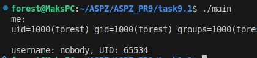
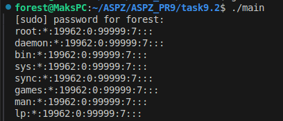
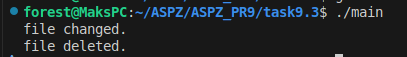
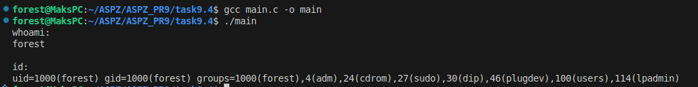
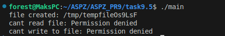
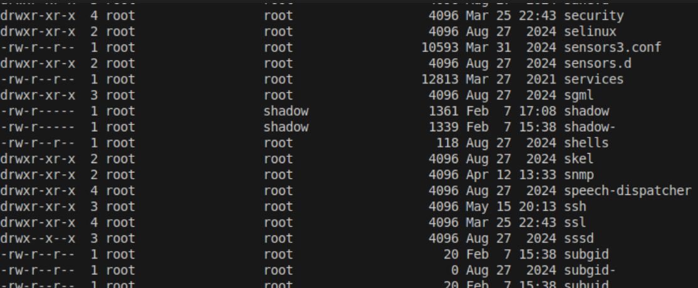
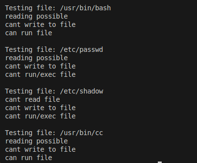
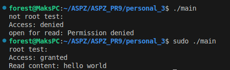

# Завдання 9.1

Напишіть програму, яка читає файл /etc/passwd за допомогою команди getent passwd, щоб дізнатись, які облікові записи визначені на вашому комп’ютері. Програма повинна визначити, чи є серед них звичайні користувачі (ідентифікатори UID повинні бути більші за 500 або 1000, залежно від вашого дистрибутива), окрім вас.

## Рішення

#### Програма виконує команду 'getent passwd', й після цього розділяє кожен рядок на відповідні поля. Якщо поле 'UID' > 1000, і користувач не є поточним в моєму випадку Я маю 'UID' == 1000, то обліковий запис є користувачем.

#### В результаті виконання програма виводить в консоль список користувачів крім поточного, знайдених в системі.

# Завдання 9.2

Напишіть програму, яка виконує команду cat /etc/shadow від імені адміністратора, хоча запускається від звичайного користувача. (Ваша програма повинна робити необхідне, виходячи з того, що конфігурація системи дозволяє отримувати адміністративний доступ за допомогою відповідної команди.)

## Рішення

#### Для виконання програми від імені адміністратора необхідно використати 'sudo' в іншому випадку доступ буде заборонено. Відповідно у самій програмі запуск буде 'sudo cat /etc/shadow' через 'system()'.

#### Відповідно, якщо користувач введе пароль та отримає доступ адміністратора, то йому виведеться вміст файлу '/etc/shadow'.

# Завдання 9.3

Напишіть програму, яка від імені root копіює файл, який вона перед цим створила від імені звичайного користувача. Потім вона повинна помістити копію у домашній каталог звичайного користувача. Далі, використовуючи звичайний обліковий запис, програма намагається змінити файл і зберегти зміни. Що відбудеться? Після цього програма намагається видалити цей файл за допомогою команди rm. Що відбудеться?
## Рішення

#### У першій частині програма від звичайного юзера створює файл. Потім за допомогою прав адміністратора копіює його в каталог користувача.
#### Після копіювання користувач намагається змінити файл (записати якісь дані), якщо не було змінено права доступу до файлу, то файл буде змінено. В іншому виведеться помилка.

#### В результаті програми видно, що користувач може змінювати файл, оскільки права доступу 'chmod' не змінювались.

# Завдання 9.4

Напишіть програму, яка по черзі виконує команди whoami та id, щоб перевірити стан облікового запису користувача, від імені якого вона запущена. Є ймовірність, що команда id виведе список різних груп, до яких ви належите. Програма повинна це продемонструвати.

## Рішення

#### Програма викликає 'whoami та id' через 'system()', ці команди виводять ім'я користувача та ідентифікатори користувача відповідно.

#### Як видно після виконання програми видно, що мій обліковий запис користувача належить декільком групам, що надають додаткові права користуванням системою.

# Завдання 9.5

Напишіть програму, яка створює тимчасовий файл від імені звичайного користувача. Потім від імені суперкористувача використовує команди chown і chmod, щоб змінити тип володіння та права доступу. Програма повинна визначити, в яких випадках вона може виконувати читання та запис файлу, використовуючи свій обліковий запис.

## Рішення

#### Програма спочатку створює тимчасовий файл '/tmp/tempfileXXXXXX' за допомогою 'mkstemp'. Потім за допомогою 'sudo chown root' та 'sudo chmod 600' змінюємо власника до права доступу відповідно.

#### Після цього звичайний користувач намагається прочитати та змінити файл. Але оскільки в нього немає прав, то в нього це не вийде.

# Завдання 9.6

Напишіть програму, яка виконує команду ls -l, щоб переглянути власника і права доступу до файлів у своєму домашньому каталозі, в /usr/bin та в /etc. Продемонструйте, як ваша програма намагається обійти різні власники та права доступу користувачів, а також здійснює спроби читання, запису та виконання цих файлів.

## Рішення

#### Програма спочатку виводить всі файли у домашній директорії користувача 'ls -l', у '/usr/bin' та '/etc' їхні права доступу. Потім викликається функція для перевірки доступів користувача до файлів. А намагається виконати операції з цими файлами (читання, запис, запуск).

#### В результаті видно, до яких файлів користувач має який доступ. Наприклад файл '/etc/shadow' недоступний для звичайного кориситувача, а файл '/usr/bin/cc' можна як прочитати так і запустити.

# Особисте завдання '3 Варіант'

Визначте, чи можна прочитати вміст файлу, якщо всі дозволи на нього зняті. Поясніть, у яких випадках це можливо.

## Рішення

#### Для того, щоб перевірити, чи можна прочитати файл, якщо з нього зняли всі дозволи, я розробив програму, що спочатку створює файл від звичайного користувача. Потім записує у файл певний текст 'hello world!' та змінює права доступу за допомогою 'chmod' на '000', тобто всі дозволи були сняті. Після цього програма перевіряє чи має доступ до цих файлів користувач. 

#### Для запуску без прав адміністратора я просто запустив програму './main' й отримав заборону на зміну файлів. В другій ситуації я запустив файл з правами адміністратора 'sudo ./main', після чого отримав доступ до файлу 'Access: granted'. Користувач з правами адміністратора ігнорує звичайні файлові дозволи.

